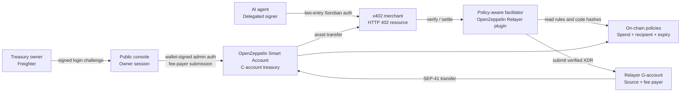
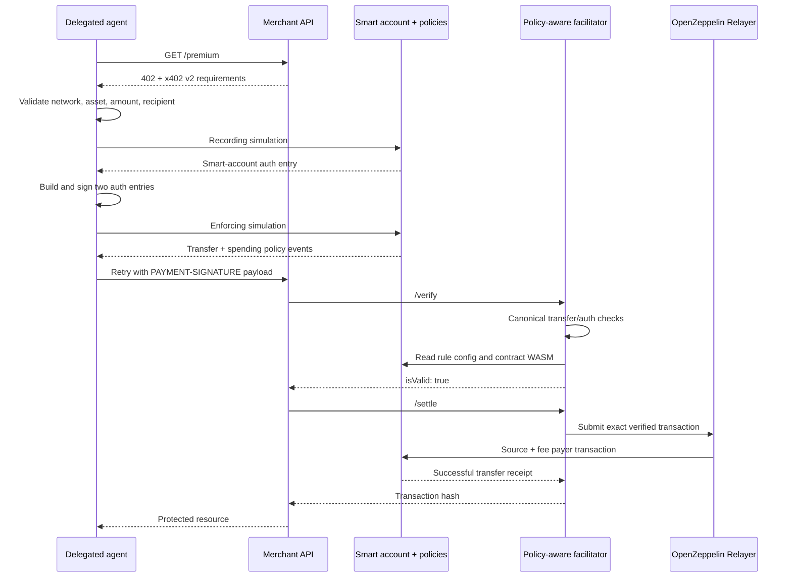
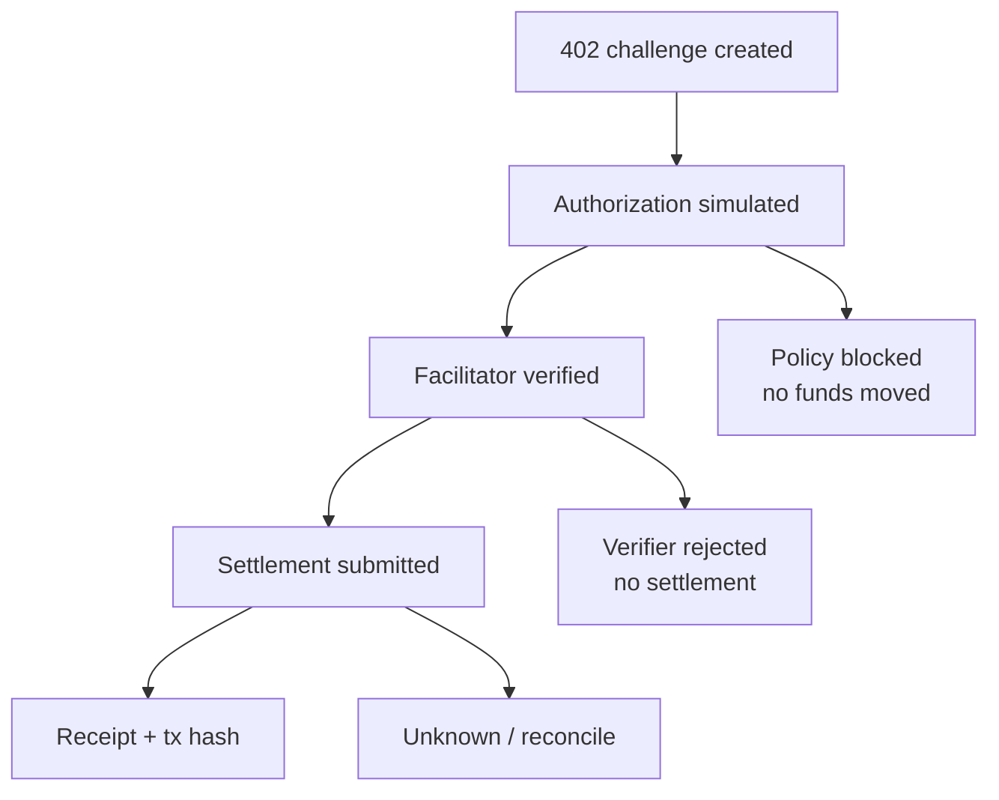

# AgentAllowance Architecture

AgentAllowance is a policy-aware x402 infrastructure layer for autonomous agent spending on Stellar.
It combines an OpenZeppelin Smart Account treasury, delegated G-account signers, on-chain allowance
policies, a strict x402 payer, and a narrowly extended OpenZeppelin facilitator. This document describes
the implemented Testnet architecture, not a hypothetical production system.

## Design goals

- Keep funds in a parent smart-account treasury rather than individual agent wallets.
- Let an agent pay autonomously after receiving a bounded delegation.
- Enforce token, recipient, amount, rolling budget, and expiry on chain.
- Preserve canonical x402 SEP-41 transfer validation.
- Admit only the proven OpenZeppelin policy event, with pinned contract and WASM identity.
- Keep relayer, admin, delegated signer, merchant, and payer roles distinct.
- Produce inspectable evidence for every allow, block, verify, and settlement decision.

## System context



The connected wallet proves ownership of the configured treasury admin address. Autonomous payments
do not return to the owner for approval: the delegated signer authorizes each payment, while the smart
account policies enforce the owner's previously configured boundaries.

## Trust boundaries

| Boundary | Holds secrets | Authority | Must not become |
| --- | --- | --- | --- |
| Treasury owner | Freighter admin key | Authenticate the owner session | Per-payment signer or relayer |
| Console server | Demo admin fallback, fee payer, delegated demo keys | Owner session, orchestration, evidence | Browser key store |
| Delegated agent | One delegated G-account key | Pay within one context rule | Treasury admin or fee payer |
| Smart account | SEP-41 asset balance | Final authorization decision | Transaction source |
| Policy contracts | On-chain rule state | Spend and recipient enforcement | General-purpose payment executor |
| Facilitator | Relayer API access | Verify exact payload and submit | Policy bypass or merchant |
| Merchant API | Challenge and receipt state | Unlock protected resource | Payer or authorization signer |

Private keys, facilitator credentials, and raw signer material never enter the React bundle. The
configured relayer G-account must be transaction source and fee payer, but must not appear as payer,
merchant, delegated signer, or any address-auth entry.

### Wallet-owner administration

The public dashboard connects directly to Freighter without a password page or route transition. The
server issues a one-time 120-second challenge; only a valid Ed25519 signature from the configured
admin address creates the 15-minute HttpOnly owner session used by mutation endpoints. Challenges are
single-use and both challenges and sessions are memory-bounded by expiry.

Create and revoke are two-phase operations. The server records the exact contract invocation and
returns an unsigned delegated admin auth entry. Freighter signs that entry; the server then requires
the configured admin address and unchanged nonce, expiry, invocation and auth tree before running
enforcing simulation. Only the relayer/fee-payer envelope signature remains server-side. The legacy
server-admin signer is retained as an explicit Testnet emergency fallback and is not used by the
wallet-owner endpoints. Autonomous delegated payment signing is independent of this admin path and
remains server-side by design.

## Contract architecture

### Treasury smart account

`contracts/treasury-account` composes OpenZeppelin `stellar-accounts` 0.7.2. Rule `0` is the admin
context. Payment allowances are independent context rules containing:

- an allowed `CallContract` context scoped to the SEP-41 token;
- one delegated G-account signer;
- a ledger-bounded expiry;
- OpenZeppelin rolling spending-limit configuration;
- an exact recipient-policy configuration.

Its `__check_auth` implementation delegates to OpenZeppelin's smart-account authorization engine.
AgentAllowance does not replace or duplicate that authorization logic.

### Spending-limit policy

`contracts/spending-limit-policy` is a thin integration of OpenZeppelin's first-party policy. It
tracks spend per context rule and emits `spending_limit_enforced` during a valid transfer. The
facilitator validates that event against the signed transfer and a manifest-pinned WASM hash.

### Recipient policy

`contracts/recipient-policy` permits only the configured token and recipient. It deliberately emits
no payment-time event in the MVP. Enforcement is proven by signed context rule IDs, on-chain rule
configuration, enforcing simulation, and rejected unapproved-recipient attempts.

## Soroban authorization model

A payment carries exactly two address-auth entries:

```text
Entry 1: smart C-account
  invocation: SEP-41 transfer(from=treasury, to=merchant, amount=N)
  signature: OpenZeppelin AuthPayload
    context_rule_ids: [allowance rule]
    signers: Delegated(agent G-account)

Entry 2: delegated G-account
  invocation: treasury.__check_auth(auth_digest)
  signature: Ed25519 delegated-signer signature
```

The invocation trees must be top-level and contain no sub-invocations. A third entry, duplicated
entry, changed address, nested invocation, or mismatched digest fails verification.

## End-to-end x402 flow



The merchant claims a challenge atomically before settlement. Concurrent retries cannot submit the
same payment twice. An ambiguous network result is stored for reconciliation and is not blindly
resubmitted.

## Facilitator extension

The extension in `packages/relayer-plugin-x402-facilitator` is a pinned, maintainable branch of the
OpenZeppelin plugin. `packages/facilitator-policy` adds one narrow acceptance path after the original
verifier succeeds on all canonical fields.

The verifier requires:

1. x402 v2 and the configured Stellar network.
2. The exact manifest-pinned SEP-41 asset.
3. One top-level `transfer(from, to, amount)` with no sub-invocations.
4. `from` equal to the smart C-account payer.
5. Recipient and amount equal to the merchant requirements.
6. Exactly the expected smart-account and delegated-signer auth entries.
7. Replay-safe, bounded, unexpired authorization.
8. One successful SEP-41 transfer event.
9. One `spending_limit_enforced` event from the approved contract and WASM hash.
10. Matching policy-event payer, token, amount, and context rule ID.
11. On-chain recipient rule matching the signed token and recipient.
12. No unknown, duplicate, spoofed, malformed, or unrelated contract events.

`recipient_policy_enforced`, MPP, arbitrary event allowlists, and verifier bypasses are explicitly out
of scope.

## Application and package map

```text
apps/
  console/                 public dashboard, wallet-owner login, operator fallback
  x402-demo-api/           402 challenge, idempotent settlement, protected resource
  testnet-cli/             deploy, authorize, verify, settle, inspect, archive
contracts/
  treasury-account/        OpenZeppelin smart-account composition
  spending-limit-policy/   rolling spending limit
  recipient-policy/        exact token and recipient restriction
packages/
  stellar-smart-account-auth/  two-entry auth construction and validation
  x402-payer/                   challenge parsing, simulation, payment payload
  facilitator-policy/           strict smart-account policy validation
  relayer-plugin-x402-facilitator/ OpenZeppelin plugin extension
  sdk/                          allowances, payments, evidence, reconciliation
  shared/                       x402 types, hashes, amounts, reason codes
```

## State and evidence

On-chain state is authoritative for balances, rule expiry, recipients, and spent amounts. SQLite is
used by the demo for allowance indexing, payment attempts, challenge claims, receipts, and
reconciliation state. Testnet scripts write append-only timestamped evidence; the compatibility proof
under `proofs/stellar-x402-smart-account/` is immutable.



## Deployment

The Testnet deployment uses three coordinated Render services: the OpenZeppelin Relayer with the
policy-aware plugin, the merchant demo API, and the console. Redis backs the Relayer queue. The
console and merchant currently use single-instance SQLite and Render's ephemeral filesystem; on-chain
state remains persistent, but application indexes may be reconstructed after a restart. Local default
SQLite filenames are namespaced by treasury C-account so evidence from separate deployments cannot be
silently merged; explicit hosted database paths remain operator-controlled.

Production requires a shared transactional database, durable evidence storage, managed key custody
or HSM signing, rate limiting, observability, disaster recovery, and independent audits of contracts,
facilitator policy, and operational controls.

## MVP and excluded scope

The proven MVP uses the official Stellar Testnet USDC SAC, one recipient per allowance, one delegated
signer per allowance, rolling spending limits, ledger expiry, x402 exact payments, and the
policy-aware facilitator. The earlier native XLM runs remain compatibility evidence. Multi-asset
rules, MPP, threshold admin,
`recipient_policy_enforced`, public SDK publication, and production custody are future work.

For exact adversarial conditions and operational assumptions, continue with the
[security model](security.md). For the fork boundary and deployment procedure, see the
[OpenZeppelin facilitator integration guide](openzeppelin-facilitator-integration.md).
